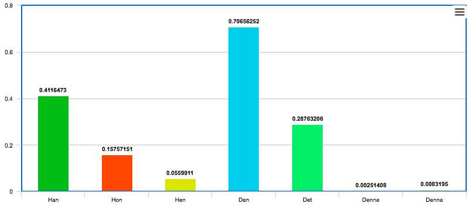

# Report ACC lab3

## Design
All code (seen under the section "code" further down) is written in a file called tasks.py, which I will come back to later.

I started out with creating a new instance of Ubuntu 16.04.

I installed celery and RabbitMQ:
```
sudo apt-get update
sudo apt-get upgrade
sudo apt-get install python-pip 
sudo apt-get install rabbitmq-server
pip install celery
```
From one terminal window I ran celery with:
```
celery -A tasks worker --loglevel=info
```
From another I ran Flask with:
```
python3 tasks.py
```
In my third window I made the REST-api call:
```
curl -i http://130.238.28.95:5000/jsoncount
```
The result can be seen in the next section.

As you can see in the code-section I only used 25 of the JSON-documents because if I used all of them the server didn't respond.
I'm also aware that currently I am only using the Flask and not celery. 
As you can see in my code there are a few lines in the beginning that are commented away. If I uncomment these lines Celery would be used. The problem for me was that I didn't recieve any results from Celery when trying. I've done my best to figure out how to solve this but sadly, I haven't had enough time. 

## Rest-api call


## Vizualization
Here is a barchart showing the occurences of the different words and the number of unique tweets counted.


This bar chart shows the same occurences of words normalized by the numer of tweets.


## Code
```
from celery import Celery
from flask import Flask, jsonify
import json
import os

flask = Flask(__name__)
app = Celery('tasks', backend='rpc://', broker='pyamqp://guest@localhost//')

@flask.route('/jsoncount', methods=['GET'])
#def jsoncount():
#    result = pronounCount.delay()
#    while not result.ready():
#        pass 
#    return result.get()

#@app.task
def pronounCount():
    data = []
    count = 0
    for filename in os.listdir('data'):
        if count < 25:
            with open ('data/'+ filename, 'r') as f:
                count += 1
                for line in f:
                    if line not in ['\n', '\r\n']:
                        data.append(json.loads(line))
    hencount = 0
    hancount = 0
    honcount = 0
    dencount = 0
    detcount = 0
    dennecount = 0
    dennacount = 0
    count = 0

    for obj in data:
        if obj["retweeted"] == False:
            text = obj["text"]
            text = text.lower()
            hencount += text.count("hen")
            hancount += text.count("han")
            honcount += text.count("hon")
            dencount += text.count("den")
            detcount += text.count("det")
            dennecount += text.count("denne")
            dennacount += text.count("denna")
            count += 1

    return("{\"han\": " + str(hancount) +
           ", \"hon\": " + str(honcount) +
           ", \"hen\": " + str(hencount) +
           ", \"den\": " + str(dencount) +
           ", \"det\": " + str(detcount) +
           ", \"denne\": " + str(dennecount) +
           ", \"denna\": " + str(dennacount) +
           ", \"nrOfTweets\":"  + str(count) + "}")


if __name__ == '__main__':
    
    flask.run(host='0.0.0.0',debug=True)
```
